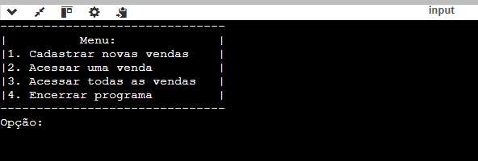

# Sistema de Gerenciamento para Loja

> Um sistema simples de gerenciamento para uma Loja de Acessórios para Celular fictícia que precisa controlar suas compras, entender seus clientes e realizar consultas de dados.
>
Esse projeto foi feito em equipe, nós utilizamos a linguagem _C_. O sistema oferece:
* **Armazenamento e Consulta de Dados:** Manipulação de arquivo `.txt`
* **Menu Interativo:** Menu em Terminal que fornece as funcionalidades do sistema

## Visualização Prévia

* Menu inicial:

* Uma das funcionalidades - Opção 2:

